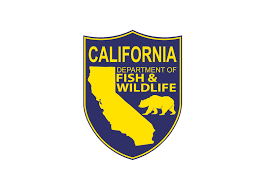

---
title: "Developing Models and Code to Test Bag Limit Policies in California State Fisheries"
author: "Tom Carruthers <tom@bluematterscience.com>"
date: "`r format(Sys.time(), '%d %B, %Y')`"
output: html_document
---
&nbsp;


<style>
  .col2 {
    columns: 2 200px;         /* number of columns and width in pixels*/
    -webkit-columns: 2 200px; /* chrome, safari */
    -moz-columns: 2 200px;    /* firefox */
  }
  .col3 {
    columns: 3 100px;
    -webkit-columns: 3 100px;
    -moz-columns: 3 100px;
  }
  .col4 {
    columns: 4 100px;
    -webkit-columns: 4 100px;
    -moz-columns: 4 100px;
  }
</style>

***


***

&nbsp;





***

```{r setup, include=FALSE}
library(dplyr)
library(kableExtra)
library(readxl)

knitr::opts_chunk$set(echo = FALSE)

getprojectinfo<-function(page){
  
  tab=as.data.frame(read_excel("Project_Info/Status Assumptions To do.xlsx", sheet = page))
  tab[is.na(tab)]=""
  kable(tab,"simple")#,col.names=rep("",2)) 
}
  


```

&nbsp;

### Disclaimer

The following work is currently preliminary and intended as tool for eliciting feedback on data, modelling and other aspects of implementing bag limit regulations in MSE. 

None of these results are final. 

These analyses do not necessarily reflect the point of view of RLF, CDFW, or other funders and in no way anticipate future policy in this area.

***

### Objective

Based on empirical data on recreational catch rate and discarding, for at least two species of california state fisheries, develop theoretical models that predict discard rates given alternative bag limit policies, and incorporate these into the open-source openMSE framework for testing management procedures.  

***

### Project details

```{r ProjDets, eval=T}
dat<-data.frame(c("Term","Funding body","Funding stream","Contract No.","Project Partners","Blue Matter Team","CDFW Principal Investigators"),
                
                 c("Jan 1 2023 - September 30 2023",
                   "Resources Legacy Fund (RLF)",
                   "FIS",
                   "17037",
                   "Blue Matter Science Ltd.",
                   "Tom Carruthers, Adrian Hordyk",
                   "Julia Coates"))

kable(dat,"simple",col.names=rep("",2)) 
 

```

***

### Introduction

Recreational fisheries are a substantial contributor to overall fishery exploitation in a number of California State fisheries. For example, for Halibut in Northern California, the recreational fishery constitutes roughly 40% of the catches. 

A primary management measure for recreational fisheries is individual (per angler) bag limits in addition to boat or trip limits. 


***

### Project Status


#### Deliverables

```{r Deliv, eval=T}
getprojectinfo("Status")
```

&nbsp;

#### Tasks

```{r Tasks, eval=T}
getprojectinfo("Tasks")
```

&nbsp;

#### Priorities

```{r Priorities, eval=T}
getprojectinfo("ATD")
```


***

### Preliminary Findings

***

### Mathematical Model Description

***

### Code to Run an Example


```{r packageinstall,echo=T, eval=FALSE}
source_url(C:\Users\tcarruth\Documents\GitHub\CDFW_Bag_Limits\Code)

```


***

### Software and Code 

[CDFW_Bag_Limit GitHub repository](https://github.com/blue-matter/CDFW_Bag_Limits)

[openMSE (MSEtool, DLMtool, SAMtool R libraries)](https://openMSE.com)


***

### Scope beyond CDFW


***

### References

[Blue Matter (2019)]()

[Hordyk 2020](https://openmse.com/multi-mse/cdfw_multimse)

[CDFW 2023a - California Halibut Enhanced Status Report](https://marinespecies.wildlife.ca.gov/california-halibut/)

[CDFW 2023b - California Halibut](https://wildlife.ca.gov/Conservation/Marine/Nearshore#56021327-california-halibut)

[CDFW 2023c - Data Limited Fisheries Management](https://wildlife.ca.gov/Conservation/Marine/Data-Limited-Fisheries)

[Porch & Fox (1990) - Simulating Bag Limits](References/Simulating_bag_limits_Porch.pdf)

[Carruthers et al. (2019) - Landscape Scale Trout Management](References/Carruthers et al Landscape Recreational Fisheries cjfas-2018-0168.pdf)

[Fisher (2012) - PhD thesis inc Bag Limit theory](References/Fisher_PhD.pdf)


***

### Acknowledgements

Special thanks to Julia Coates for her help in providing and explaining the various datasets.

This work was funded by the [Resources Legacy Fund](https://resourceslegacyfund.org/) - many thanks to Huff McGonigal for coordinating support for this project. 


***

&nbsp;&nbsp;&nbsp;&nbsp;&nbsp;&nbsp;&nbsp;&nbsp;&nbsp;&nbsp;&nbsp;&nbsp;

