---
title: "Developing Models for Testing Bag Limit Policies in California State Fisheries"
author: "Tom Carruthers <tom@bluematterscience.com>"
date: "`r format(Sys.time(), '%d %B, %Y')`"
output: html_document
---
&nbsp;


<style>
  .col2 {
    columns: 2 200px;         /* number of columns and width in pixels*/
    -webkit-columns: 2 200px; /* chrome, safari */
    -moz-columns: 2 200px;    /* firefox */
  }
  .col3 {
    columns: 3 100px;
    -webkit-columns: 3 100px;
    -moz-columns: 3 100px;
  }
  .col4 {
    columns: 4 100px;
    -webkit-columns: 4 100px;
    -moz-columns: 4 100px;
  }
</style>

***


***

&nbsp;


***

```{r setup, include=FALSE}
library(dplyr)
library(kableExtra)
library(readxl)
library(DT)

knitr::opts_chunk$set(echo = FALSE)
# setwd("C:/Users/tcarruth/Documents/Github/CaliBL/docs")


getprojectinfo<-function(page,addcol=F,dummy=F){
  tab=as.data.frame(read_excel("Project_Info/Status Assumptions To do.xlsx", sheet = page))
  tab[is.na(tab)]=""
  dt<-datatable(tab,caption=NULL,options(dom='t'),rownames = F )  
  if(addcol){
    nbk <- 100
    j = ncol(tab)
    brks <- seq(0,100,length.out=nbk)
    y <- round(seq(255, 40, length.out = nbk + 1), 0)
    clrs <- rainbow(nbk + 1, start=0.05,end=0.3)
    dt <- DT::formatStyle(dt, j, backgroundColor = DT::styleInterval(brks, clrs))
  }
  if(!dummy)return(dt)
}

```

&nbsp;

### Disclaimer

The following work is preliminary and intended to elicit feedback on data, modelling and other aspects of implementing bag limit regulations in MSE for California state fisheries. 

None of these results are final. 

These analyses do not necessarily reflect the point of view of CDFW, RLF or other funders, and in no way anticipate future policy in this area.

***

### Objective

Based on observed recreational catch rate and release rate data, develop theoretical models for at least two species of California state fisheries that predict release rates given alternative bag limit policies, and incorporate these into the open-source [openMSE](https://openmse.com/) framework for testing management procedures.  

***

### Project details

```{r ProjDets, eval=T}
dat<-data.frame(c("Term","Funding body","Funding stream","Contract No.","Project Partners","Blue Matter Team","CDFW Principal Investigator"),
                
                 c("Jan 1 2023 - June 1 2024",
                   "Resources Legacy Fund (RLF)",
                   "FIS",
                   "17037",
                   "Blue Matter Science Ltd.",
                   "Tom Carruthers, Adrian Hordyk",
                   "Julia Coates"))

kable(dat,"simple",col.names=rep("",2)) 
 

```


***

### Introduction

Recreational fisheries are a substantial contributor to overall fishery exploitation in a number of California state fisheries. For example, over recent years the recreational fishery for Northern California Halibut constitutes roughly 40% of the total catches. 

Individual angler bag limits and boat limits remaing a primary management measure for recreational fisheries. When evaluating the performance of alternative management policies that vary bag limits it is necessary to account for the impacts on yields and biological risk due to post-release mortality. 

CDFW has begun the process of implementing Management Strategy Evaluation for various fisheries ([CDFW 2023a - Data Limited Fisheries Management](https://wildlife.ca.gov/Conservation/Marine/Data-Limited-Fisheries), [Hordyk et al. (2017)](https://www.datalimitedtoolkit.org/wp-content/uploads/2017/07/Applying-MSE-to-CA-Fisheries-Case-Studies-Recommendations.pdf)
, [Valencia et al. 2021](https://nrm.dfg.ca.gov/FileHandler.ashx?DocumentID=195538&inline)). 

Preliminary multi-sex, multi-fleet operating models were developed for California Halibut using the [openMSE](www.openMSE.com) framework ([CDFW 2023b - California Halibut Enhanced Status Report](https://marinespecies.wildlife.ca.gov/california-halibut/), [CDFW 2023c - California Halibut](https://wildlife.ca.gov/Conservation/Marine/Nearshore#56021327-california-halibut)). To rigorously account for bag limit impacts on the stock and fishery it is necessary to build openMSE-compatible management procedures that realistically account for these dynamics. 

This first phase of the project (Deliverable A) derives such a bag-limit-release-rate model (e.g. [Carruthers et al. (2019)](References/Carruthers et al Landscape Recreational Fisheries cjfas-2018-0168.pdf)
, [Porch & Fox (1990)](References/Simulating_bag_limits_Porch.pdf), [Fisher (2012)](References/Fisher_PhD.pdf)) from empirical data and demonstrates this for an example Halibut operating model. 

Following projects steps will refine data inputs, fine-tune the derived bag-limit-release-rate models, and construct fully featured multi-fleet operating models from recent stock assessments of California Halibut. The approach will then be extended to at least one additional species. 

&nbsp;

***


### Project Status

The project is currently on-schedule. Bag limit models, management procedures and operating models have been developed for both California halibut and black rockfish in the northern management area (north of Point Sur). 

&nbsp;

#### Deliverables

This project page and the code and information linked from it, are intended to satisfy Deliverables A - C. 

```{r Deliv, eval=T, results='asis'}
getprojectinfo("Status",T,T)
getprojectinfo("Status",T)

```

&nbsp;

#### Tasks

Tasks A - C require further scrutiny and collaboration with CDFW scientists. These will reach 100% completion when data, release-rate models and operating models have been refined further. 

```{r Tasks, eval=T, results='asis'}
getprojectinfo("Tasks",T)
```

&nbsp;

#### Priorities

The key priorities are now finalizing analyses and drafting final reports / peer-reviewed papers. 

```{r Priorities, eval=T, results='asis'}
getprojectinfo("ATD")
```


***
&nbsp;

### Summary of Findings 

* Management performance outcomes are relatively insensitive to alternative bag limits.

* Performance results for halibut were at least as sensitive to the bag limit model (source of data for model fitting) as the bag limit evaluated, and are therefore an important source of uncertainty. 

* Bag limits do not effectively reduce exploitation rate at low stock sizes and imply a harvest control rule that contrasts with traditional approaches. 

* Effort controls (e.g., N.o. vessel licenses, number of vessel-days) are likely to be a superior basis for managing exploitation.

* The current halibut size limit of 55 cm is well suited to maximizing yield at an intermediate level of biological risk.

* Projecting management outcomes for both the Base Case and the Depleted operating models, suggests there is a relatively low risk of biomass dropping below MSY levels for both the halibut and black rockfish case studies. 

&nbsp;

### Methods

For both the halibut and black rockfish case studies there were six methodological components (for greater detail please see the [draft report](Reports/Extending MSE to Evaluate Bag Limit Regulations.pdf):

1) Process trip level data from three sources: logbook party/charter (LB_PC), California Recreational Fishery Survey party/charter (CRFS_PC) and CRFS private rental (CRFS_PR) and evaluate how frequently it would be expected that historical bag limits were triggered based on trip level catches. 

2) Develop theoretical bag limit models that can predict mean release rates from mean catch rates. 

3) Fit theoretical bag limit models to data to establish which model provides the most appropriate approximation of the observed dynamics. 

4) Codify those bag limit models into management procedures

5) Specify fishery operating models based on empirical stock assessments (a plausible hypothesis for fishery and population dynamics) and also alternatives for robustness/ sensitivity testing. 

6) Conduct closed-loop (MSE-style) projections of various management options including alternative bag-limits to evaluate their properties and efficacy. 

&nbsp;

### Results

An overview of results is provided here for both halibut and black rockfish in the northern management area. For more detailed description of methods and preliminary results a [draft report is available](Reports/Extending MSE to Evaluate Bag Limit Regulations.pdf).

#### Statistical distribution of observed recreational CPUE 

Only the northern management area data provided catch rates consistently high enough to trigger historical bag limits.  

&nbsp;

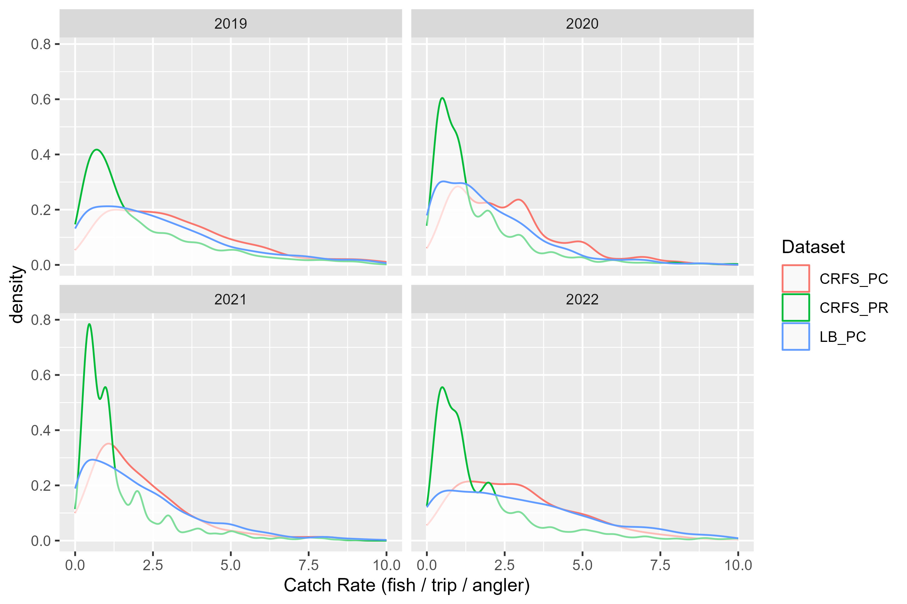

Figure 1. Distribution of trip-level halibut catch rates over recent years for the northern management area for the three data sources: logbook party/charter (LB_PC), California Recreational Fishery Survey party/charter (CRFS_PC) and CRFS private rental (CRFS_PR). 

&nbsp;

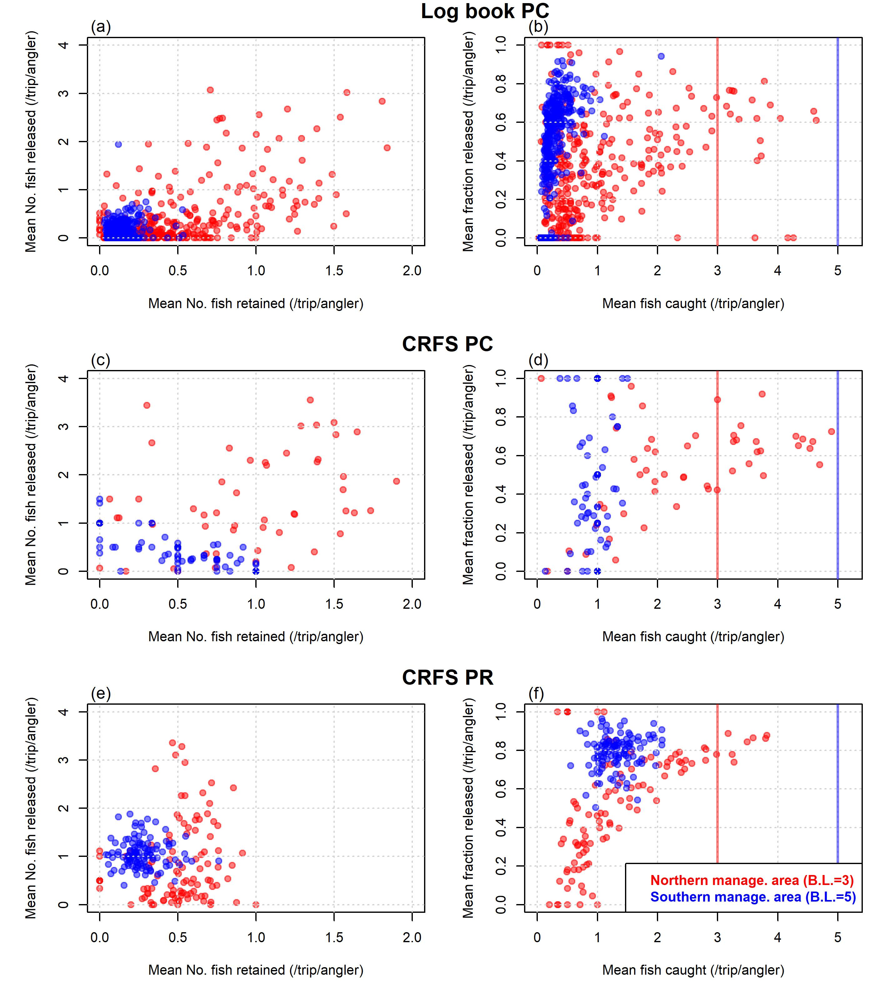

Figure 2. Observed relationship between mean monthly catch rates and release rates of halibut in both southern and northern management areas by data type. 

&nbsp;


Figure 3. An empirical analysis quantifying expected release rate of halibut given observed catch rate data and historical bag limits. 

&nbsp;


Figure 4. An empirical analysis quantifying expected release rate of black rockfish given observed catch rate data and historical bag limits. 

&nbsp;

#### Theoretical bag limit models


Catch rate data are typically assumed to follow either binomial, negative binomial, Poisson (for discrete data) or log-normal distributions. Statistical distributions used elsewhere such as the binomial and negative binomial distributions (e.g., Porch and Fox 1990) very poorly  approximated the observed distribution of catch rates (Figures 2.1 and 2.2) and were not considered further. A number of Poisson and log-normal models were investigated to approximate the observed mean catch rate and mean release rate (Table 1). Here release rate refers to the proportion of caught fish by number that were released by number (sometimes referred to as ‘potential catch’, Lew and Larson 2014). 


Table 1. Statistical models for predicting mean release rate (across all trips) from mean catch rate (across all trips). Models include two discrete Poisson models with and without a constant background release rate (Pois and PoisV, respectively), and five continuous lognormal distributions that: do not model background release rate (LN), include a constant background release rate (LNV), includes two parameters for background release rate for trips catching below/above 1 fish (LN2V), models background release rate as a linear relationship with mean catch rate (LNVS) and a similar approach with both intercept and slope in the relationship between background release rate and mean catch rate (LNVSI). Note that the numbers released (r) and retained (k) are calculated from the integral of the density and the catch rate. Since there is no closed-form solution to the integral of a normal distribution, integration was approximated numerically.  
 


&nbsp;


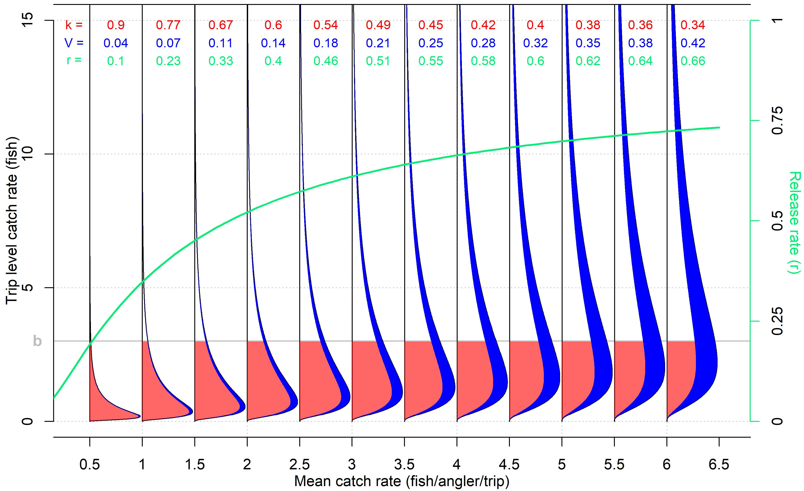

Figure 5. Components of the log-normal bag limit model LNVS that includes a linearly increasing background release rate (V, blue), the fraction of fish that are retained (k, red) and the release rate (r, green). Although the log-normal density is plotted here, the expected number of fish released and retained was calculated from the integral of the product of the density and the catch rate (i.e. based on expected numbers of fish retained and released, not the proportion of trips).

&nbsp;


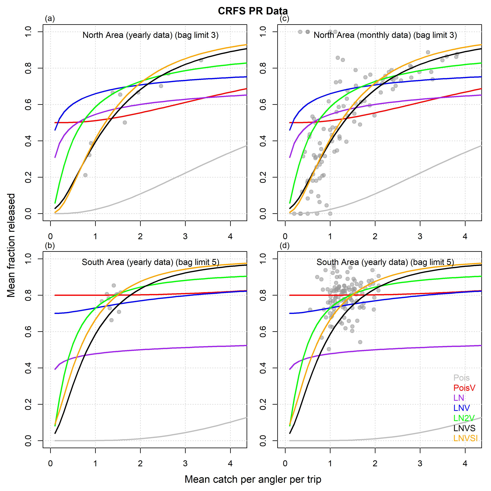

Figure 6. Fit of alternative bag limit models to historical observed mean catch rate and observed proportion released for California halibut in the northern management area.  

&nbsp;


#### Fit of theoretical bag limit models

The lognormal model that included a linearly increasing background release rate with catch rate, was selected as the most appropriate theoretical model for halibut and black rockfish in the northern area (Figure 7)

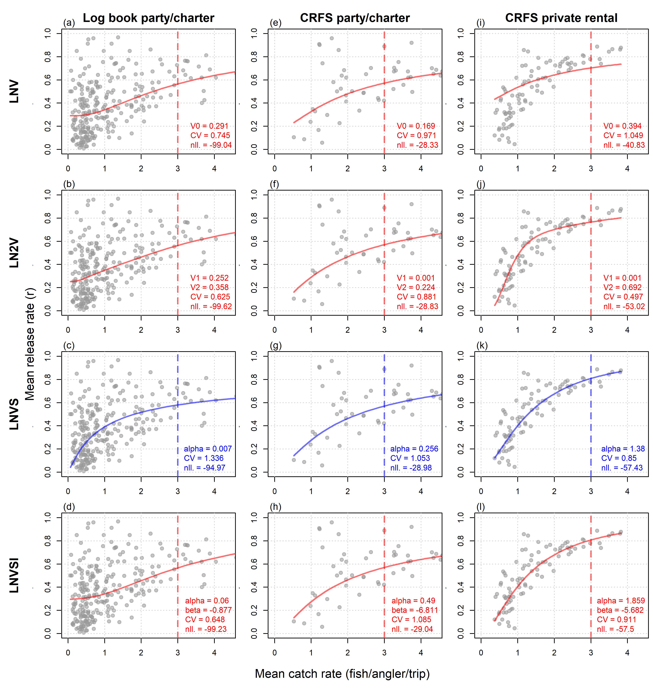

Figure 7. Model fitting results for the northern management area for three data types (columns) and four log-normal bag limit models (Table 2) that estimate: (LNV) a constant background release rate (parameter V0); (LN2V) constant background release rates for catch rates below (V1) and above (V2) 1 fish per angler per trip; (LNVS) a linearly increasing (inverse logit space) background release rate calculated from the slope (alpha) with mean catch rate; (LNVSI) the same model with an intercept (beta, inverse logit space). Grey points are observed monthly mean catch rate and mean release rates (1980 - 2023 logbook, 2016-2023 CRFS party/charter, 2013-2023 CRFS private rental). The vertical dashed line denotes the 3-fish bag limit for the northern management area. The colored lines represent the maximum likelihood fit of each bag limit model through the data. Included in each panel are the estimated parameters including the log-normal coefficient of variation (CV) and negative log-likelihood (nll) of the model fit. 

  

&nbsp;

#### Specifying operating models for halibut and black rockfish

The most recent age-structured stock synthesis assessments for halibut and black rockfish were converted to OpenMSE operating models (Figures 8 and 9). 


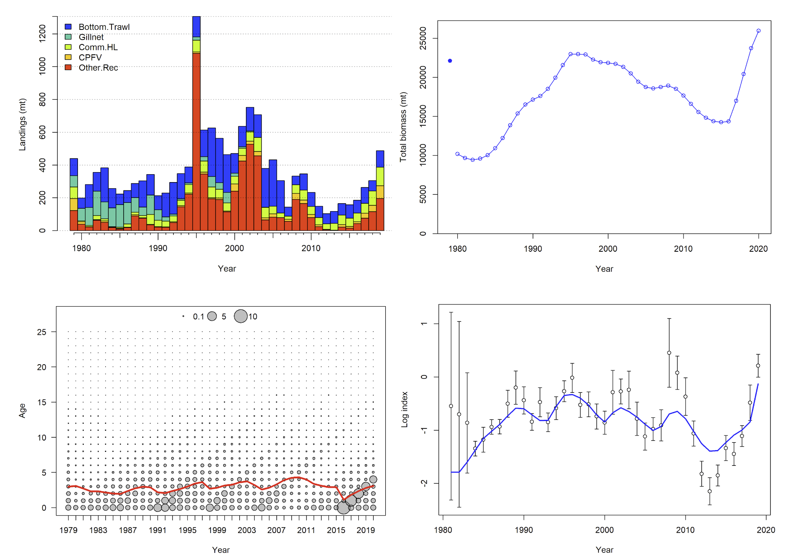

Figure 8. A selection of data and model estimates from the recent stock assessment for the northern California stock: catches by fleet (top left), maximum likelihood estimate (MLE) of total stock biomass (top right), MLE age structure (bottom left) and the MLE model fit (blue line) to the observed relative abundance index of the Commercial Passenger Fishing Vessel (CPFV) fleet (black points and bars) (bottom right). Note that total biomass in 2020 is estimated to be above equilibrium unfished conditions (the blue point plotted at 1979 on the top right panel).  

&nbsp;

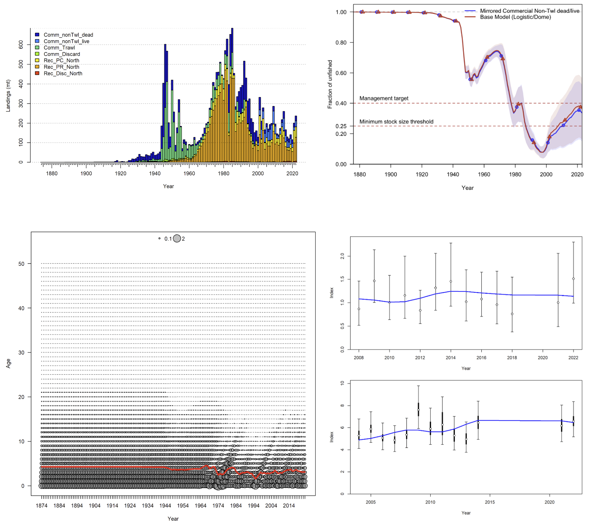

Figure 9. A selection of data and model estimates from the recent stock assessment for the northern California black rockfish stock: catches by fleet (top left), maximum likelihood estimate (MLE, line) and 90% interval of total stock biomass (top right), MLE age structure (bottom left) and the MLE model fit (blue line) to two of the CPUE based relative abundance indices (bottom right). Note that total biomass in 2023 is estimated to be around the management target level with a relatively high degree of uncertainty, including values below the minimum stock size threshold.  


#### Projections

The observed catch rate data were added to the operating model and linked to vulnerable biomass. This means that a future index of catch rate is simulated and passed to the MPs under projection. The MPs can then calculate the predicted release rate in closed-loop. To make sure that the catch rates of the operating model were known perfectly, the index was simulated with no error. 

Bag limits between 1 and 6 (a wide range for halibut) were less consequential in determining biomass and yield outcomes than +/- 20% changes in fishing effort (Figure 10).


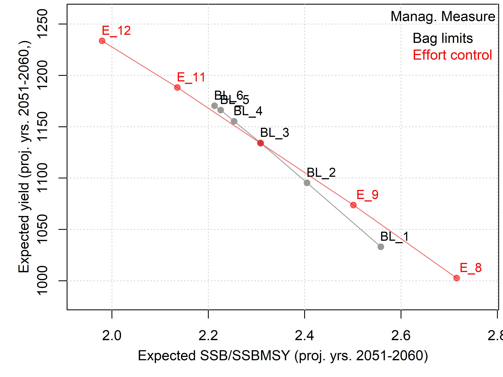

Figure 10. The impact of halibut bag limits from 1 - 6 (BL_1, BL_2, … BL_6) (black) and overall effort control (as a % of FMSY fishing effort: E_8 is 80% FMSY, E_12 is 120% FMSY) (bag limit = 3) (red) on the long term (2051-2060) mean spawning biomass relative to MSY levels, and fishery yields. Closed-loop simulations (n=144) were carried out for the ‘Depleted’ operating model. 

&nbsp;

Generally, bag limits had a relatively weak impact on future projected biomass and yield for northern area halibut (Figure 11).

&nbsp;

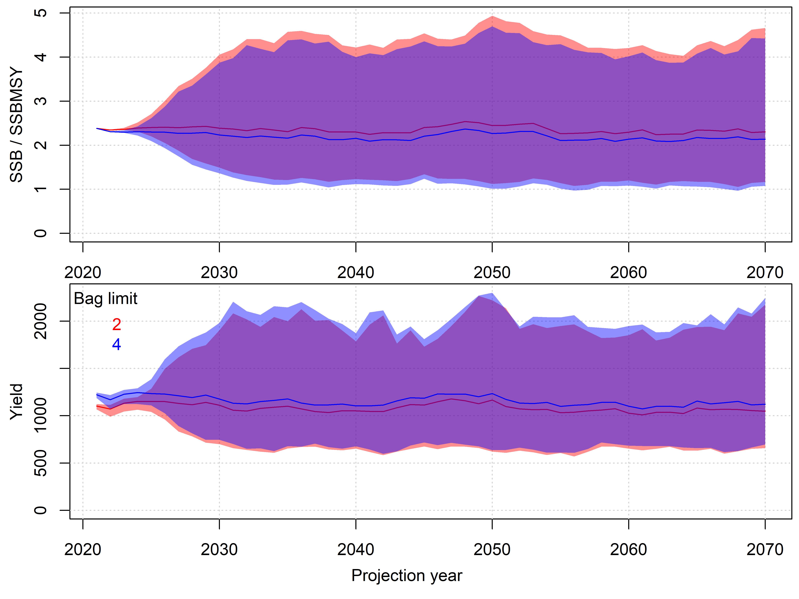

Figure 11. Projection of yield and spawning biomass for northern halibut given bag limits of 2 and 4 fish. The solid lines represent the median value over 144 simulations, the shaded regions are the 90% interquantile range.

&nbsp;

Current size limit regulations correspond with maximum projected long term yield (Figure 12).  

&nbsp;

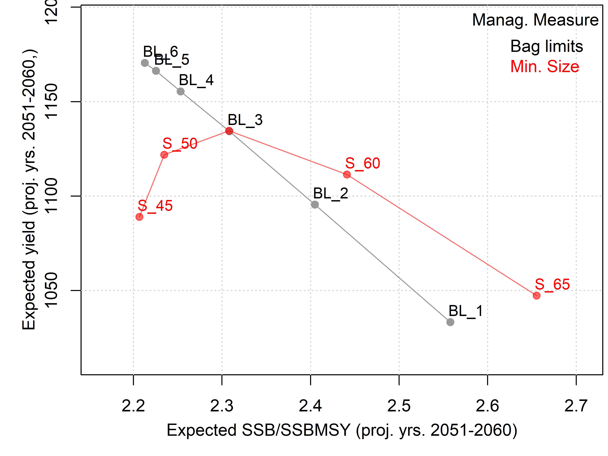

Figure 12. The impact of halibut bag limits from 1 - 6 (BL_1, BL_2, … BL_6) (black) and minimum size limit control from 45cm to 65cm (S_45, S_50, … S65) (red) on the long term (2051-2060) mean spawning biomass relative to MSY levels, and fishery yields. Closed-loop simulations (n=144) were carried out for the  ‘Depleted’ operating model starting from 40% unfished levels. 

&nbsp;

The pattern of exploitation rate with stock size for bag limit regulations appears to run contrary to conventional harvest control rules that throttle exploitation rate at low stock sizes (Figures 13 and 14).

&nbsp;

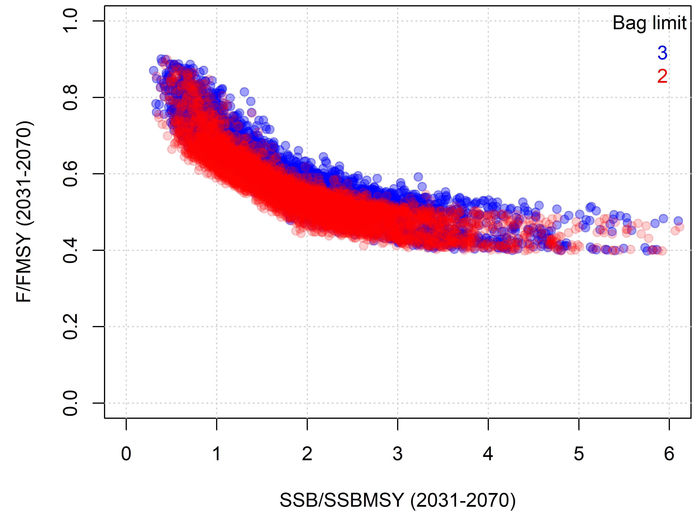

Figure 13. Implied harvest control rule of halibut bag limits. The 2 and 3-fish bag limits of the default bag limit model (CRFS private/rental) were projected for the Depleted operating model at 150% FMSY fishing effort to reveal the relationship between projected spawning biomass and the fishing mortality rate arising from the bag limit. The higher exploitation rate was required to obtain simulations with biomass below MSY levels. 

&nbsp;

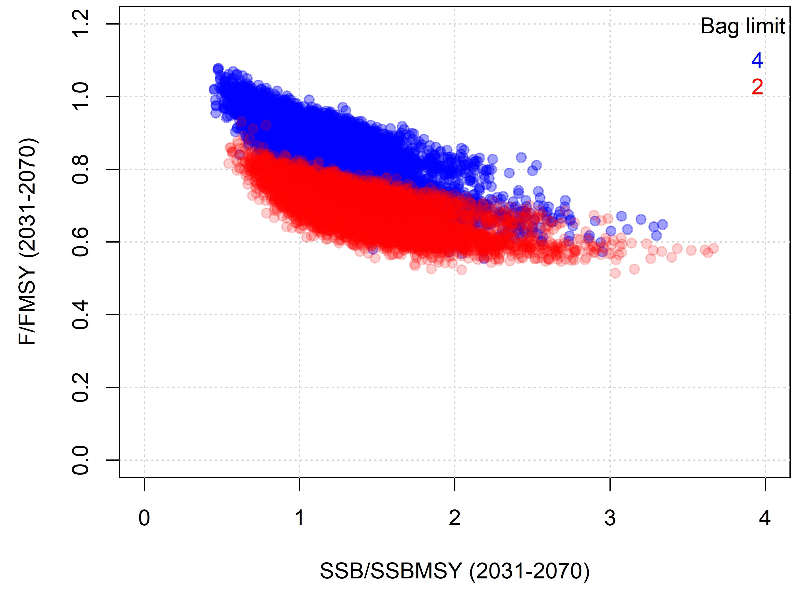

Figure 14. Implied harvest control rule of bag limits for black rockfish. The 2 and 4-fish bag limits of the default bag limit model (CRFS private charter) were projected for the Depleted operating model at 150% FMSY fishing effort to reveal the relationship between projected spawning biomass and the fishing mortality rate arising from the bag limit. The higher exploitation rate was required to obtain simulations with biomass below MSY levels. 

&nbsp;


***

### Code to Run an Example

The code has been organized in a dedicated R package hosted on a public GitHub repository [CaliBL](https://github.com/Blue-Matter/CaliBL). This makes downloading MPs and operating models relatively simple. 

Installation:

```{r packageinstall,echo=T, eval=FALSE}
install.packages(openMSE)
install.packages(devtools)
devtools::install_github('blue-matter/CaliBL')
packageVersion('CaliBL')

```

Run the example code to produce the plots above:

```{r rundemo,echo=T, eval=FALSE}
library(CaliBL)

avail('MP') # black rockfish MPs are denoted BRF
avail('OM') # halibut operating models are H_, black rockfish are BRF_

MSE_halibut = Project(H_N_small,c("BL_2","BL_4","BL_6")) # project 2, 4 and 6 bag limits for halibut
Pplot(MSEobj,maxsims=50)              
TradePlot(MSEobj,"P50","Yield")     

MSE_BRF = Project(BRF_N_small,c("BL_BRF_2","BL_BRF_4","BL_BRF_6")) # project 2, 4 and 6 bag limits for black rockfish


```


***

### Software and Code 

[CDFW_Bag_Limit GitHub repository](https://github.com/blue-matter/CDFW_Bag_Limits)

[openMSE (MSEtool, DLMtool, SAMtool R libraries)](https://openMSE.com)


***

### References

[Carruthers et al. (2019) - Landscape Scale Trout Management](References/Carruthers et al Landscape Recreational Fisheries cjfas-2018-0168.pdf)

[CDFW 2023a - Data Limited Fisheries Management](https://wildlife.ca.gov/Conservation/Marine/Data-Limited-Fisheries)

[CDFW 2023b - California Halibut Enhanced Status Report](https://marinespecies.wildlife.ca.gov/california-halibut/)

[CDFW 2023c - California Halibut](https://wildlife.ca.gov/Conservation/Marine/Nearshore#56021327-california-halibut)

[Fisher (2012) - PhD thesis inc Bag Limit theory](References/Fisher_PhD.pdf)

[Hordyk 2020](https://openmse.com/multi-mse/cdfw_multimse)

[Hordyk et al. (2017)](https://www.datalimitedtoolkit.org/wp-content/uploads/2017/07/Applying-MSE-to-CA-Fisheries-Case-Studies-Recommendations.pdf)

[Porch & Fox (1990) - Simulating Bag Limits](References/Simulating_bag_limits_Porch.pdf)

[Valencia et al. 2021](https://nrm.dfg.ca.gov/FileHandler.ashx?DocumentID=195538&inline)

***

### Acknowledgements

Special thanks to Julia Coates and Laura Ryley for their help in providing and explaining the various datasets.

This work was funded by the [Resources Legacy Fund](https://resourceslegacyfund.org/) - many thanks to Huff McGonigal for coordinating support for this project. 


***

&nbsp;&nbsp;&nbsp;&nbsp;&nbsp;&nbsp;&nbsp;&nbsp;&nbsp;&nbsp;&nbsp;&nbsp;

